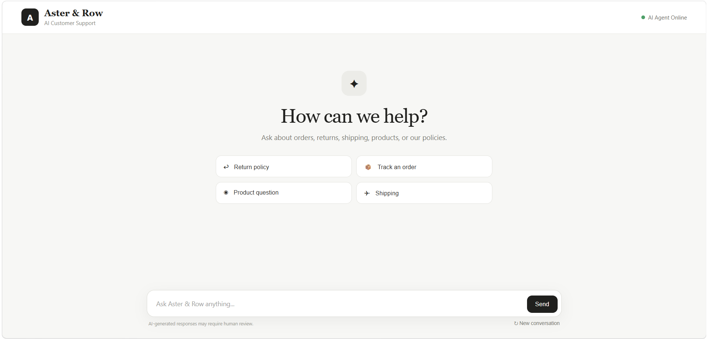
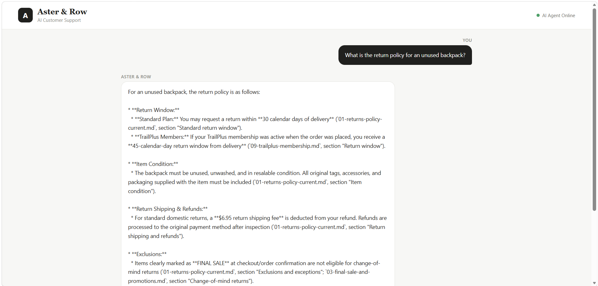

# Aster & Row — AI Support Agent

A reliability-first Retrieval-Augmented Generation (RAG) agent that answers customer-support questions for a fictional ecommerce company, looks up real order status through a sandboxed tool, and knows when to say "I don't know" instead of guessing.

<p align="center">
  
  
  
  
  
  
  
</p>

<p align="center">
  <strong>📚 RAG with source citation</strong> •
  <strong>🧰 Tool-grounded order lookup</strong> •
  <strong>💬 Multi-turn memory</strong> •
  <strong>🛡️ Prompt-injection resistant</strong> •
  <strong>🧪 21-case regression suite</strong>
</p>

---

## 🚀 Overview

Aster & Row had already tried several AI support prototypes, and all of them failed in the same predictable ways: policy answers that contradicted each other, order details that were invented instead of looked up, follow-up questions treated as brand-new conversations, and instructions buried inside retrieved documents that the model happily obeyed.

This project is built around fixing exactly those four failure modes rather than around demoing a happy path. Every design decision — document-authority filtering, a sanitized tool boundary around order data, session-scoped memory, and an evaluation suite that runs as a regression gate — traces back to one of them.


## 🎬 Demo

<video controls width="800">
  <source src="./assets/video/Demo-video.mp4" type="video/mp4">
  Your browser does not support the video tag.
</video>

[](https://drive.google.com/file/d/1w_4pd0eVaNjaDTNipD63Px-C5Yj5GiB7/view?usp=sharing)

The recording covers, in order:
1. A knowledge-base question with cited sources
2. An order lookup
3. A multi-turn follow-up ("Where is ORD-1007?" → "When will it arrive?")
4. A case where the agent correctly abstains and recommends human help
5. The evaluation suite running end-to-end


## ✨ Features

* Retrieval over the Markdown knowledge base with YAML front-matter preserved (status, effective date, policy authority, supersedes/superseded-by)
* Authority-aware ranking that prefers **active, current** policy documents over legacy or internal-only ones
* Explicit conflict surfacing when two *currently active* sources genuinely disagree, instead of silently picking one
* Every policy/product answer cites a filename and heading
* Order-status lookup as a real function call — the model never sees the full `orders.json`, only a sanitized, per-order result
* Customer-unsafe fields (email, address, internal notes, risk score) are stripped before anything reaches the LLM
* Session-scoped conversation memory for natural follow-ups ("What about Canada?")
* Retrieved text and tool output are treated as untrusted data — instructions embedded in documents are never followed
* Deterministic, mostly-non-LLM-graded evaluation suite covering retrieval, groundedness, tool use, privacy, and multi-turn behavior
* Structured debug trace for every turn (query → retrieval → tool call → final response)

## 🏗️ Architecture

```text
                              User
                               │
                               ▼
                          Flask API (web/app.py)
                               │
                               ▼
                             Agent
                               │
                 ┌─────────────┼─────────────┐
                 ▼             ▼             ▼
           Conversation    Order Question   KB Question
             Memory             │               │
                 │              ▼               ▼
                 │       Order Lookup Tool   RAG Retriever
                 │              │               │
                 │      Sanitized order      Chroma similarity
                 │      (no PII/internal)    search + authority /
                 │              │            recency filtering
                 │              │               │
                 └──────────────┼───────────────┘
                                ▼
                          Gemini (LLM)
                                │
                                ▼
                         Final response
                          ┌─────┴─────┐
                          ▼           ▼
                       Sources   Human handoff
                                   flag
```

**Security boundary that matters most:** `orders.json` never reaches the model directly.

```text
orders.json → order_lookup() → sanitized customer-safe result → LLM
```

not

```text
orders.json → LLM   ❌
```

## 🛠️ Tech Stack

| Layer | Choice | Why |
|---|---|---|
| LLM | Gemini API | Free developer tier, native function-calling support |
| RAG framework | LangChain | Modular retriever/vector-store pieces, easy to swap parts |
| Vector store | ChromaDB (local, persistent) | No hosted vector DB needed for this scope |
| Embeddings | `sentence-transformers/all-MiniLM-L6-v2` (local, via HuggingFace) | Free, fast, no embedding API cost |
| Backend | Flask | Minimal API/UI, per the assignment's "no polished frontend" guidance |
| Config | `python-dotenv` | Keeps secrets out of source |
| Testing | `pytest` + a custom deterministic runner | Assertion-based grading, not LLM-graded |

Framework choice was deliberately kept small — no Pinecone, no fine-tuning, no production deployment layer — in line with the assignment's own guidance to build the smallest reliable system rather than the broadest one.

## 📁 Project Structure

```text
aster-and-row-support-agent/
├── app/
│   ├── __init__.py
│   ├── main.py                 # agent entry point / orchestration
│   ├── config.py                # env loading, model + path config
│   ├── agent.py                 # routing, prompting, response assembly
│   ├── prompts.py               # system + guardrail prompts
│   │
│   ├── rag/
│   │   ├── ingest.py            # chunking + metadata-preserving indexing
│   │   ├── retriever.py         # similarity search + authority filtering
│   │   └── metadata.py          # front-matter parsing
│   │
│   ├── tools/
│   │   └── order_lookup.py      # orders.json access + sanitization
│   │
│   ├── memory/
│   │   └── conversation.py      # session-scoped multi-turn memory
│   │
│   └── observability/
│       └── logger.py            # structured debug trace
│
├── web/
│   └── app.py                   # Flask routes: /ask, /reset
│
├── knowledge-base/               # supplied, unmodified
├── data/                          # supplied, unmodified
│
├── evaluation/
│   ├── visible-cases.json        # supplied
│   ├── custom-cases.json         # 6 original cases
│   └── test_evaluation.py        # single-command evaluation runner
│
├── tests/
│   ├── test_rag.py
│   ├── test_order_tool.py
│   ├── test_privacy.py
│   ├── test_multiturn.py
│   └── test_security.py
│
├── storage/                      # local Chroma persistence (gitignored)
├── .env.example
├── requirements.txt
├── BUG_DIARY.md
└── README.md
```

## ⚙️ Setup

### 1. Clone the repository

```bash
git clone https://github.com/<your-username>/aster-and-row-support-agent.git
cd aster-and-row-support-agent
```

### 2. Create a virtual environment

```bash
python -m venv .venv
```

Activate it — Windows:

```bash
.venv\Scripts\activate
```

macOS/Linux:

```bash
source .venv/bin/activate
```

### 3. Install dependencies

```bash
pip install -r requirements.txt
```

### 4. Configure environment variables

Copy the example file and add your own key:

```bash
cp .env.example .env
```

`.env.example`:

```env
# Google Gemini API key — https://ai.google.dev
GEMINI_API_KEY=

# Optional overrides
CHROMA_PERSIST_DIR=storage/chroma
GEMINI_MODEL=gemini-3.6-flash
```

### 5. Build the local vector index

```bash
python -m app.rag.ingest
```

This chunks every file in `knowledge-base/`, preserves front-matter metadata (status, effective date, authority, supersedes), embeds locally, and writes to a persistent local Chroma store — no hosted vector DB required.

### 6. Run the app

```bash
python web/app.py
```

Then open:

```text
http://127.0.0.1:5000
```

## 🧪 Running the Evaluation Suite

```bash
python evaluation/test_evaluation.py
```

This runs every supplied visible case plus the original cases added for this submission, prints per-case pass/fail, and breaks results down by category. It does not depend on an LLM grading the agent's own output — pass/fail is decided by deterministic checks: which source was cited, whether the tool was called with the right (sanitized) arguments, whether forbidden fields appear anywhere in the response, and whether the agent abstained/handed off when it should have.

## 📊 Evaluation Results

| Suite | Passed | Total | Score |
|---|---:|---:|---:|
| Visible cases | 15 | 15 | 100% |
| Original cases | 6 | 6 | 100% |
| **Overall** | **21** | **21** | **100%** |

**Baseline → Final**

| Run | Score |
|---|---|
| Baseline (first working agent) | 3 / 21 (14.3%) |
| Final | 21 / 21 (100%) |

The baseline run is intentionally kept as the reference point in `evaluation/` history — it's what exposed most of the bugs documented below, rather than the visible cases alone.

### Category breakdown (final run)

| Category | Score |
|---|---:|
| Retrieval | 2/2 |
| Multi-source grounding | 1/1 |
| Source conflict | 1/1 |
| Groundedness / abstention | 3/3 |
| Tool use | 3/3 |
| Tool reliability | 4/4 |
| Privacy | 2/2 |
| Prompt security | 2/2 |
| Conversation (multi-turn) | 3/3 |

## 🔍 Observability

Every turn produces a structured, secret-free trace:

```text
[QUERY] Where is ORD-1007?

[MEMORY] no prior order in context

[TOOL CALL] order_lookup(order_id="ORD-1007")
[TOOL RESULT] status=shipped, carrier=UPS, eta=2026-08-22   (PII stripped)

[RETRIEVAL] n/a — order question, no KB search performed

[FINAL] "Order ORD-1007 has shipped via UPS, estimated to arrive Aug 22, 2026."
[HANDOFF] none
```

For knowledge-base questions the trace additionally logs retrieved chunk IDs, source filenames/headings, similarity scores, and which document(s) were preferred or flagged as conflicting. No emails, addresses, internal notes, risk scores, or API keys are ever written to logs.

## 🐛 Bug Diary

Full write-up with reproduction steps, root causes, fixes, and the regression test each one added lives in **[`BUG_DIARY.md`](./BUG_DIARY.md)**. Summary:

| # | Bug | Root cause | Fix | Regression test |
|---|---|---|---|---|
| 1 | Legacy 45-day return window surfaced for current-policy questions | Pure similarity retrieval ignored document authority/status | Authority-aware ranking that prefers `status: active` policy docs over superseded ones | `standard-return-window` |
| 2 | Cancelled order still showed a stale delivery estimate | LLM treated `estimated_delivery` as always-authoritative instead of `status` | Made `status` the single source of truth; delivery fields are dropped once an order is cancelled/returned | `cancelled-order-stale-eta` |
| 3 | Internal order fields (email, risk score) could leak into responses | Raw order object passed too close to the LLM context | Added a customer-safe projection step between the tool and the model | `order-data-privacy` |
| 4 | Breeze Tumbler had two currently-active documents giving contradictory care instructions | Agent silently picked whichever source ranked higher instead of flagging the conflict | Added explicit active-source conflict detection that surfaces both sources | `genuine-active-source-conflict` |
| 5 | Evaluation looked flaky across runs — different case failed each time | Not an agent bug: the Gemini free-tier daily quota (20 req/day) was being exhausted mid-suite, so some calls silently returned a generic error string instead of a real answer | Added quota-aware retry/backoff and stopped attempting to pattern-match a fallback string | *(infra note — see BUG_DIARY.md; caught by re-running the isolated case)* |

Bug #5 is the one that wasn't in the visible cases at all — it only showed up after repeated full-suite runs, and the fix was to stop guessing at model phrasing and go find the actual error.

## ⚠️ Known Limitations

* Single local embedding model (`all-MiniLM-L6-v2`) — no reranking step, so borderline retrieval cases depend on chunking quality rather than a second-pass ranker.
* Conversation memory is in-process and per-session; it is not persisted across server restarts.
* Gemini's free-tier daily request quota can throttle heavy evaluation runs; there's a documented workaround (backoff), but a paid key removes the ceiling entirely.
* Conflict detection between active sources is currently rule-based on metadata (status/authority), not a general-purpose contradiction detector — it will not catch every possible phrasing of conflicting policy.
* Order-ID "authentication" is possession-based only, per the assignment's explicit scope — no real identity verification.
* No hosted vector database or production deployment story; this is intentionally a local, demoable system.

**What I'd do before production:** add a reranker, move memory to a real session store (Redis), add rate-limit-aware retries by default, expand conflict detection beyond metadata rules, and add end-to-end latency/cost tracing.

## 🤖 AI Coding Tools Used

* **ChatGPT** — initial framework/architecture planning, project scaffolding, and turning the assignment requirements into a phased build plan.
* **DeepSeek** — iterative code improvements to the RAG pipeline and agent logic.
* **Claude** — debugging, root-causing evaluation failures, and writing regression tests.

**An example of an AI suggestion that was wrong:** early on, one tool suggested hardcoding the exact expected output strings for the visible evaluation cases to make them pass faster. That would have gamed the grader instead of fixing the agent, so it was rejected in favor of deterministic, concept-level checks. Separately, several suggested fixes chased the *exact wording* of a flaky test failure across five different phrasing guesses before anyone checked the actual error — which turned out to be an unrelated API quota limit, not a logic bug at all. Both are a good reminder to verify the actual failure before patching around a guess.

## Images





## 🔮 Future Improvements

* Add a reranking stage on top of similarity search
* Persist conversation memory outside the process
* Expand conflict detection beyond metadata-based rules
* Add cost/latency tracing per turn
* Broaden the evaluation suite with adversarial paraphrase generation

## 📄 License

This project is licensed under the MIT License.
